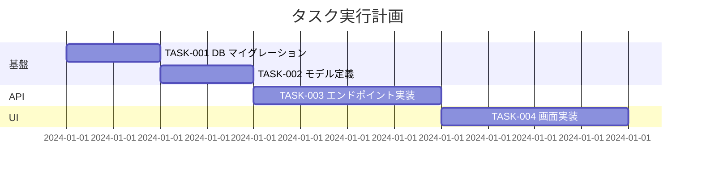

# タスク依存関係の明示

## 目的
実行順序をレビュー時に即座に判断可能にする。

## ルール
tasks.mdの末尾に、必ず依存関係を図示すること。

### フォーマット（Mermaid Gantt推奨）



### 代替フォーマット（テキスト）
図が複雑になる場合はリスト形式も可：

```markdown
## 依存関係
- TASK-001 → TASK-002 → TASK-003 → TASK-004
- TASK-001 → TASK-005（並行可能）

## クリティカルパス
TASK-001 → TASK-002 → TASK-003 → TASK-004（合計12時間）
```

### ルール
- 並行実行可能なタスクは明示すること
- クリティカルパスを特定すること
- 外部依存（他チームの作業待ち等）がある場合は明記すること
